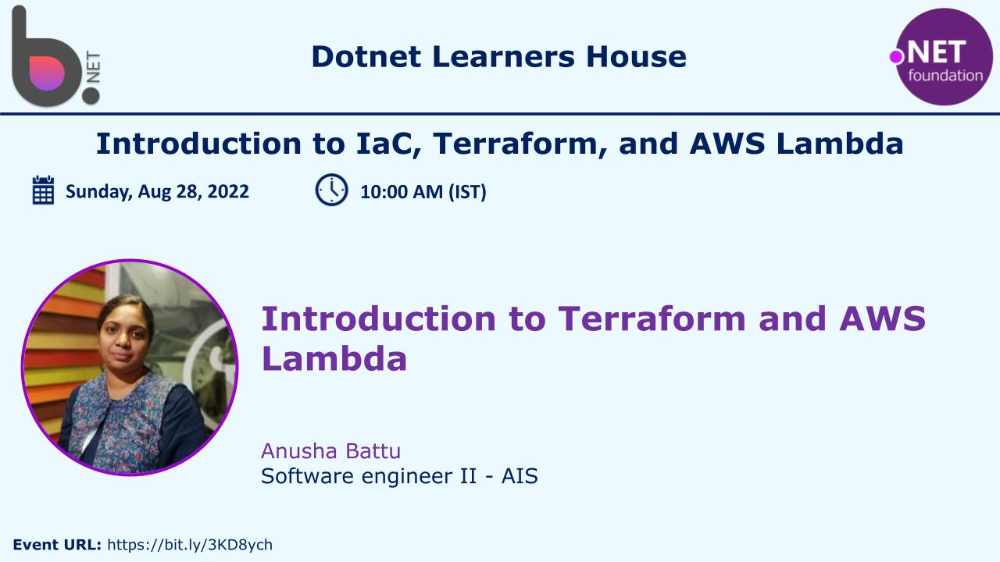
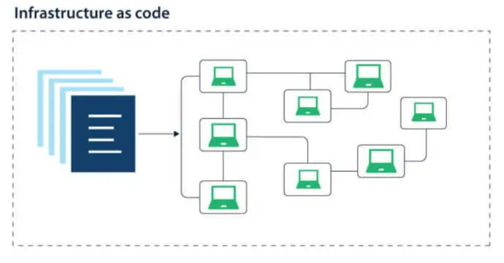
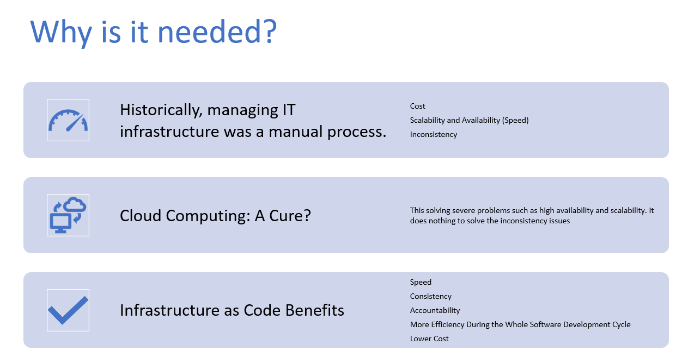
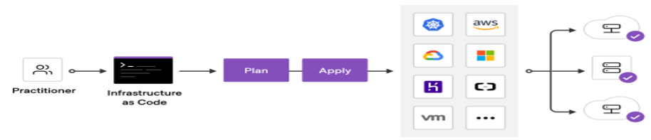
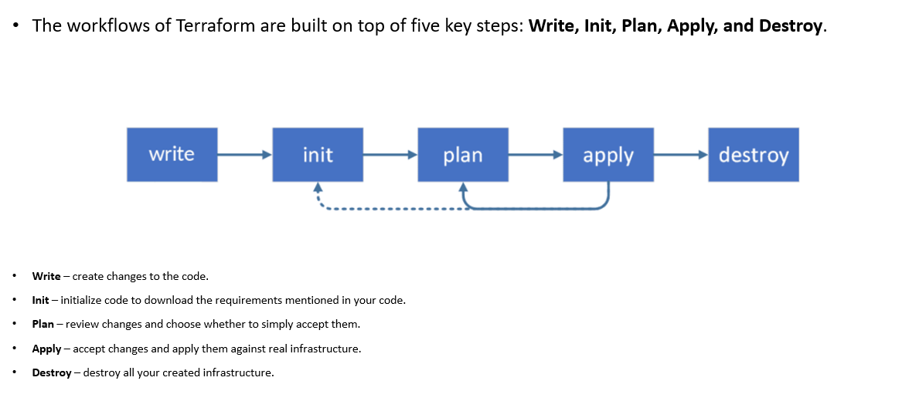
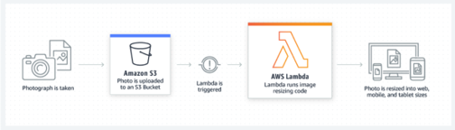
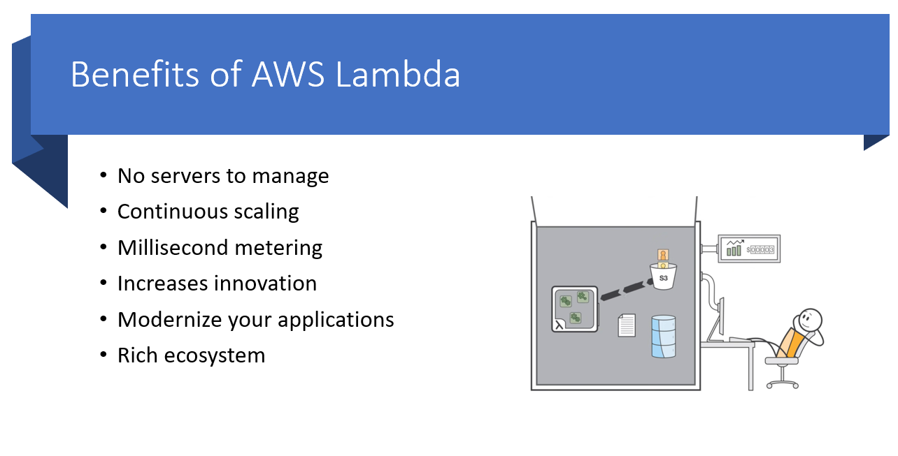

# Introduction to IaC, Terraform, and AWS Lambda

### Date Time: 28-Aug-2022 at 9:00 AM IST

Event URL:https://www.meetup.com/dot-net-learners-house-hyderabad/events/286027708/

Youtube URL:https://www.youtube.com/watch?v=LOr8iGd1i8s

## Prerequisites:

N/A

## Software/Tools

> Terraform
> AWS Lambda

## Languages:

N/A

## Information

## 

## What are we doing today?

> 1. What is IaC, Why is it needed, Way to Approach IaC
> 2. What is Terraform, Basic Concept of Terraform Workflow
> 3. Introduction to AWS Lambda, Benefits of AWS Lambda

## 1. What is IaC, Why is it needed, Way to Approach IaC

## 2. What is Terraform, Basic Concept of Terraform Workflow

## 3. Introduction to AWS Lambda, Benefits of AWS Lambda

